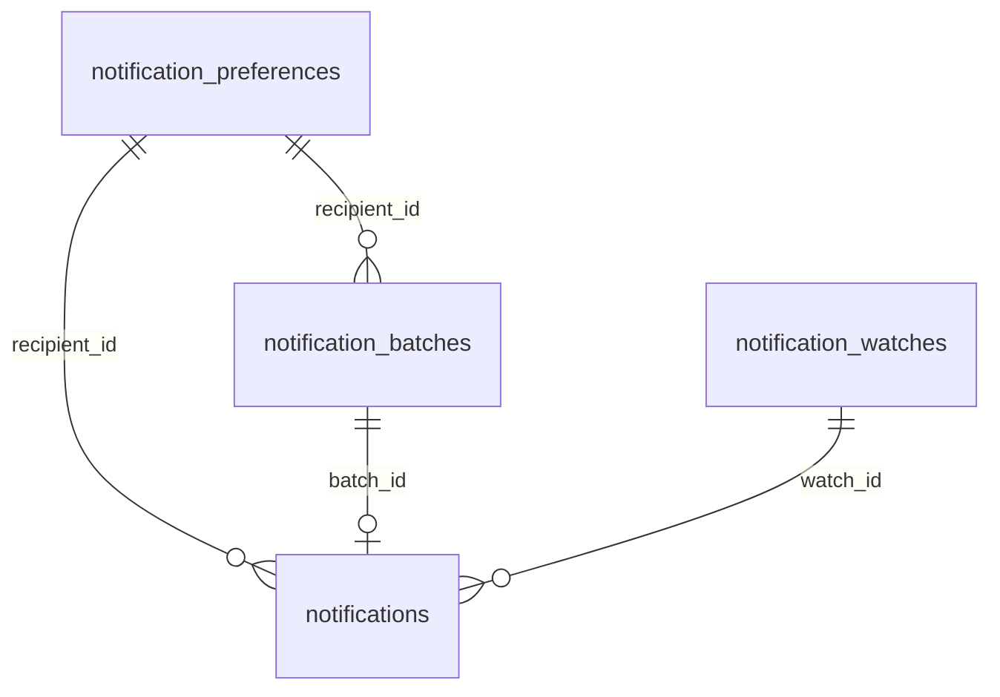
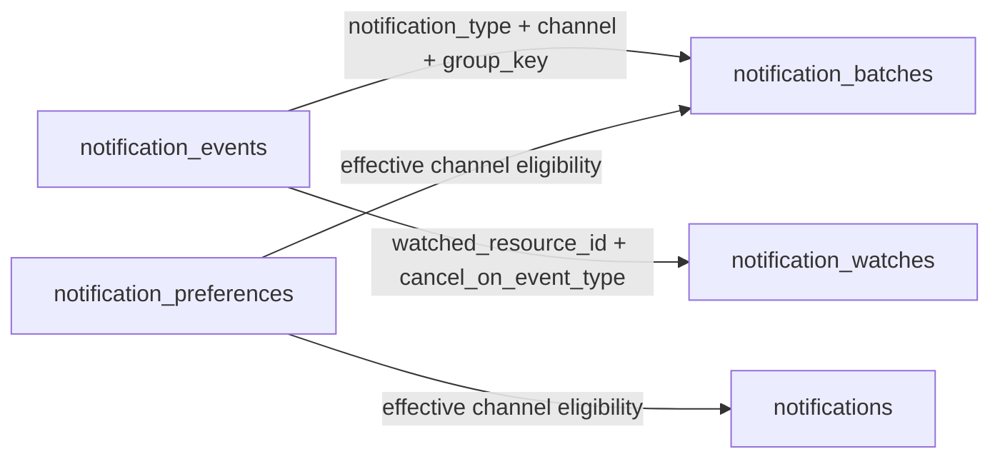

# Data Model

Five tables support the notification system end to end: an append-only event log, user preference state, mutable batch state, mutable watch state, and finalized notifications.

> [!IMPORTANT]
> Grouping policy lives in application code, but the schema must preserve the computed grouping dimensions, channel, and debounce window so in-app and email can aggregate independently.

> [!IMPORTANT]
> Preference policy also lives in application code. Events should still be recorded even when a channel is disabled for delivery.

> [!NOTE]
> Event rows are append-only. Only batch and watch rows are mutable during normal operation.[^mutability]

## At A Glance

| Table                    | Purpose                                           | Mutation Pattern                      |
| ------------------------ | ------------------------------------------------- | ------------------------------------- |
| notification_events      | Canonicalized event audit log                     | Insert-only                           |
| notification_preferences | Per-user channel/type notification settings       | Insert + update                       |
| notification_batches     | Channel-specific sliding-window aggregation state | Insert + update until closed          |
| notification_watches     | Deadline-based absence tracking                   | Insert + update until fired/cancelled |
| notifications            | Final channel-specific notification record        | Insert-only                           |

---

## Grouping Policy

Grouping policy is computed in the Express backend or a dedicated batching service, not by the database. The data model persists the results of that policy.

The policy has to support different grouping dimensions by notification type, different grouping dimensions by channel, channel-specific debounce windows, and asset-level subjects even when the triggering resource is a share link.

| Notification Type           | In-App Group On | Email Group On | Canonical Subject |
| --------------------------- | --------------- | -------------- | ----------------- |
| asset_added                 | user + board    | board          | asset             |
| comment_created             | user + asset    | asset          | asset             |
| assets_downloaded           | user + board    | board          | asset             |
| asset_share_link_viewed     | asset           | asset          | asset             |
| asset_share_link_not_viewed | asset           | asset          | asset             |

The code path for an incoming event can therefore create or extend up to two open batches:

- one in-app batch with a 2-minute debounce window
- one email batch with a 10-minute debounce window

---

## Entity Relationships

This model uses two relationship types: persisted links in storage and runtime associations in processing logic.

### Persisted Links (Foreign-Key Backed)



- `notification_preferences.user_id` is the preference owner and matches the `recipient_id` used during batching and delivery
- `notifications.batch_id -> notification_batches.id` when source is batch aggregation
- `notifications.watch_id -> notification_watches.id` when source is watch firing
- A batch is channel-specific, so one closed batch yields one finalized notification row
- A watch can fan out to more than one channel-specific notification row

### Runtime Associations (Lookup-Backed)



- Events are immutable input records and do not store direct foreign keys to batch or watch rows
- Preference lookup resolves whether a recipient is eligible for a given `(channel, notification_type)`
- Batch association is resolved during ingestion using `notification_type`, `channel`, and `group_key`
- Watch association is resolved during ingestion and finalization using the watched resource plus the cancel event type

### Why This Split Exists

- Persisted links provide clean lineage from delivered notifications back to their trigger state
- Lookup-backed runtime associations keep ingestion fast and avoid over-coupling event rows to mutable state
- Channel-specific batch rows let the system honor different grouping rules and debounce windows without introducing special cases into finalization
- Preference resolution can be evaluated both at aggregation time and finalization time without changing event immutability

---

## Table Specifications

### notification_events

Append-only log of canonicalized incoming events written on every user action.

| Column                | Type        | Notes                                                                |
| --------------------- | ----------- | -------------------------------------------------------------------- |
| id                    | UUID (PK)   |                                                                      |
| recipient_id          | UUID        | User who will receive the notification                               |
| actor_id              | UUID        | User who performed the action; nullable for anonymous/public traffic |
| raw_event_type        | VARCHAR     | Examples: asset.created, comment.created, share_link.viewed          |
| notification_type     | ENUM        | Examples: asset_added, comment_created, assets_downloaded            |
| subject_type          | ENUM        | Canonical thing the notification is about, usually asset             |
| subject_id            | UUID        | Canonical subject identifier                                         |
| container_type        | ENUM        | Optional grouping container, for example board                       |
| container_id          | UUID        | Optional grouping container id                                       |
| trigger_resource_type | ENUM        | Raw resource that caused the event, for example share_link           |
| trigger_resource_id   | UUID        | Raw resource id                                                      |
| metadata              | JSONB       | Render context such as titles, previews, comment snippets, counts    |
| created_at            | TIMESTAMPTZ |                                                                      |

Notes:

- `notification_type` is the stable product-facing category used by batching and rendering.
- `subject_type` and `subject_id` let share-link events still roll up to an asset-level notification.
- `container_id` supports rules like `user + board` and `board` without parsing JSON.

### notification_preferences

Per-user settings that control delivery eligibility by channel and notification type.

| Column            | Type        | Notes                                              |
| ----------------- | ----------- | -------------------------------------------------- |
| id                | UUID (PK)   |                                                    |
| user_id           | UUID        | Recipient/user this preference applies to          |
| channel           | ENUM        | `in_app` or `email`                                |
| notification_type | ENUM        | Nullable; `NULL` means channel default             |
| enabled           | BOOLEAN     | `true` to allow notifications, `false` to suppress |
| mute_until        | TIMESTAMPTZ | Nullable temporary mute end time                   |
| created_at        | TIMESTAMPTZ |                                                    |
| updated_at        | TIMESTAMPTZ |                                                    |

Indexes:

- `(user_id, channel, notification_type)`: effective-preference lookup
- `(user_id, channel)`: channel-default lookup

Notes:

- Type-specific rows override channel defaults.
- Resolution precedence is: type-specific row, then channel default, then system default.
- This table controls channel eligibility only. It does not mutate or remove `notification_events` rows.

### notification_batches

One row per active or recently closed channel-specific sliding batch window.

| Column            | Type        | Notes                                                                      |
| ----------------- | ----------- | -------------------------------------------------------------------------- |
| id                | UUID (PK)   |                                                                            |
| recipient_id      | UUID        | User receiving the notification                                            |
| notification_type | ENUM        | Canonical notification type                                                |
| channel           | ENUM        | `in_app` or `email`                                                        |
| group_key         | VARCHAR     | Computed key built by code from the applicable grouping rule               |
| actor_id          | UUID        | Populated when the grouping rule includes actor/user                       |
| subject_type      | ENUM        | Canonical subject type                                                     |
| subject_id        | UUID        | Canonical subject id                                                       |
| container_type    | ENUM        | Optional grouping container type, for example board                        |
| container_id      | UUID        | Optional grouping container id                                             |
| event_count       | INTEGER     | Atomic increment on matching events                                        |
| window_start      | TIMESTAMPTZ | First event timestamp in the batch                                         |
| window_end        | TIMESTAMPTZ | Extended on each matching event using the channel-specific debounce window |
| status            | ENUM        | `open -> closed`                                                           |
| created_at        | TIMESTAMPTZ |                                                                            |
| updated_at        | TIMESTAMPTZ |                                                                            |

Indexes:

- `(recipient_id, channel, notification_type, group_key, status)`: open-batch lookup during aggregation
- `(channel, window_end, status)`: expired-batch scan during finalization

Notes:

- `group_key` is not a fixed schema formula. The backend computes it from policy.
- Separate rows per channel allow in-app and email to close on different schedules.
- The denormalized grouping columns make queries and troubleshooting easier than relying on `group_key` alone.

### notification_watches

One row per time-based trigger rule, such as "share link not viewed in 5 days."

| Column                | Type        | Notes                                                           |
| --------------------- | ----------- | --------------------------------------------------------------- |
| id                    | UUID (PK)   |                                                                 |
| recipient_id          | UUID        | User to notify if the watch fires                               |
| notification_type     | ENUM        | Example: asset_share_link_not_viewed                            |
| subject_type          | ENUM        | Canonical subject type, usually asset                           |
| subject_id            | UUID        | Canonical subject id                                            |
| watched_resource_type | ENUM        | Raw resource being watched, for example share_link              |
| watched_resource_id   | UUID        | Raw watched resource id                                         |
| cancel_on_event_type  | VARCHAR     | Raw event that cancels the watch, for example share_link.viewed |
| fire_at               | TIMESTAMPTZ | Deadline to fire if still active                                |
| status                | ENUM        | `active -> cancelled` or `active -> fired`                      |
| metadata              | JSONB       | Extra render context such as share link title or asset metadata |
| created_at            | TIMESTAMPTZ |                                                                 |
| updated_at            | TIMESTAMPTZ |                                                                 |

Indexes:

- `(fire_at, status)`: expired-watch scan during finalization
- `(watched_resource_id, cancel_on_event_type, status)`: watch cancellation lookup during ingestion

Notes:

- Watches stay channel-agnostic because they represent trigger state, not aggregation state.
- The notification service can fan a fired watch out into one notification row per channel.

### notifications

Finalized channel-specific notification record created from either a closed batch or a fired watch.

| Column            | Type        | Notes                                                       |
| ----------------- | ----------- | ----------------------------------------------------------- |
| id                | UUID (PK)   |                                                             |
| batch_id          | UUID (FK)   | Nullable, references `notification_batches.id`              |
| watch_id          | UUID (FK)   | Nullable, references `notification_watches.id`              |
| recipient_id      | UUID        |                                                             |
| channel           | ENUM        | `in_app` or `email`                                         |
| notification_type | ENUM        | Canonical notification type                                 |
| event_count       | INTEGER     | Batch count snapshot; use `0` for watch-based notifications |
| payload           | JSONB       | Rendered notification payload                               |
| created_at        | TIMESTAMPTZ |                                                             |

Constraints:

- Exactly one of `batch_id` or `watch_id` is non-null.[^xor]

Notes:

- Each row represents one finalized notification for one channel.
- In-app and email are stored separately because they can come from different grouping rules and different debounce windows.

---

## Lifecycle Semantics

```text
notification_events  -> INSERT per incoming event
notification_preferences -> INSERT/UPDATE per user settings change
notification_batches -> UPSERT one open batch per affected channel/group
                     -> ONLY when effective preference allows that channel/type
                     -> UPDATE event_count + window_end while open
                     -> UPDATE status = closed on expiry
notification_watches -> INSERT on watched resource creation
                     -> UPDATE status = cancelled on cancel_on event
                     -> UPDATE status = fired when fire_at <= now and active
notifications        -> INSERT one row per finalized channel-specific notification
                     -> ONLY when effective preference allows that channel/type at finalization time
```

Example for one `asset_added` event:

- write one `notification_events` row
- upsert one `in_app` batch keyed by `recipient + actor + board` when in-app is enabled
- upsert one `email` batch keyed by `recipient + board` when email is enabled

---

## SQL Implementation Notes

<details>
<summary>Enum Strategy</summary>

- Prefer enums for stable domains: `notification_type`, `status`, `subject_type`, `container_type`, and `channel`.
- Prefer `VARCHAR` for raw event names such as `asset.created` or `share_link.viewed` if the catalog is expected to evolve.

</details>

<details>
<summary>Operational Guardrails</summary>

- Enforce idempotent close, fired, and cancelled transitions.
- Prevent duplicate open batches for the same `(recipient_id, channel, notification_type, group_key)`.
- Prevent duplicate active watches for the same `(recipient_id, notification_type, watched_resource_id)`.
- Keep notification rows immutable after insertion for reliable auditability.

</details>

---

[^mutability]: Mutable state is intentionally limited to aggregation and watch lifecycle tables to keep retries simple.

[^xor]: Enforce with a check constraint: `(batch_id IS NOT NULL) <> (watch_id IS NOT NULL)`.
