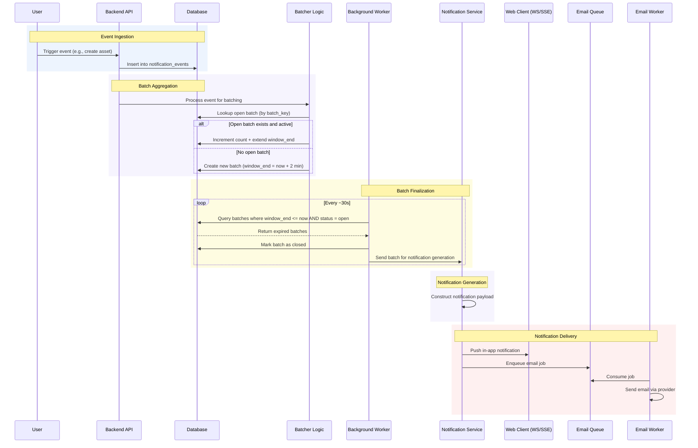
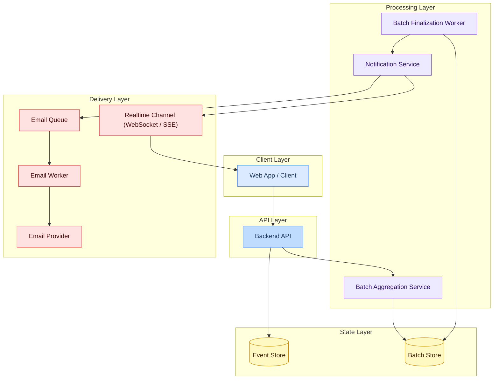

# Event Flow and Architecture

## Event Flow (Sequence Diagram)

The sequence diagram shows how a single event moves through the system from ingestion to downstream delivery. The flow breaks into five phases:

1. **Event Ingestion:** A user action (e.g., asset CRUD, download, share) triggers an event, which the backend API records and stores.
2. **Batch Aggregation:** The system computes a batching key and evaluates whether an open batch exists. The batch is either updated (count incremented and window extended) or a new batch is created.
3. **Batch Finalization:** A background worker periodically scans for batches whose time window has expired and marks them as closed.
4. **Notification Generation:** The finalized batch is transformed into a summarized notification payload.
5. **Notification Delivery:** The notification is fanned out to downstream channels, including real-time in-app delivery and asynchronous email processing.

This view is useful for understanding control flow and timing boundaries, especially where synchronous request handling ends and asynchronous processing begins.

## Architecture Diagram

The sequence diagram above explains behavior over time. The architecture diagram below translates that behavior into concrete runtime boundaries, showing where responsibilities sit, which components own persistence, and how delivery fans out across realtime and asynchronous channels.

## Implementation in AWS

The AWS mapping below keeps the logical architecture intact while choosing managed services that reduce operational overhead. The intent is to preserve a simple ingestion path, isolate background work, and keep delivery channels independently scalable.

### Client Layer

| Component        | Service         | Notes                                                                      |
| ---------------- | --------------- | -------------------------------------------------------------------------- |
| Web App / Client | S3 + CloudFront | Static hosting; communicates with the Express API over HTTP and WebSockets |

### API Layer

| Component       | Hosting                            | Responsibilities                                                                                                  |
| --------------- | ---------------------------------- | ----------------------------------------------------------------------------------------------------------------- |
| Express Backend | ECS/Fargate or EC2, fronted by ALB | Event ingestion, batch aggregation orchestration, writes to Event and Batch stores, publishing to SQS/EventBridge |

### Processing Layer

| Component                 | Trigger                          | Responsibilities                                                   |
| ------------------------- | -------------------------------- | ------------------------------------------------------------------ |
| Batch Aggregation Service | Synchronous — on event ingestion | Batch key computation, lookup/update, window creation or extension |
| Batch Finalization Worker | EventBridge Scheduler            | Query expired batches, mark as closed, enqueue notification jobs   |
| Notification Service      | Async — SQS/EventBridge          | Construct notification payloads, fan out to delivery channels      |

### State Layer

| Store       | Service              | Notes                                                      |
| ----------- | -------------------- | ---------------------------------------------------------- |
| Event Store | DynamoDB or Postgres | Append-only event log for audit and replayability          |
| Batch Store | DynamoDB (preferred) | Atomic counters, conditional updates, TTL-based expiration |

> [!NOTE]
> DynamoDB is the preferred choice for the Batch Store — atomic conditional writes and TTL expiration map directly onto the batching model with no extra infrastructure. Postgres is a viable alternative if the system already uses it and the batching logic requires relational queries.

### Delivery Layer

| Component        | Service                              | Notes                                                                            |
| ---------------- | ------------------------------------ | -------------------------------------------------------------------------------- |
| Realtime Channel | Express WebSocket / Socket.io on ECS | Alternative: API Gateway WebSocket for a fully decoupled deployment              |
| Email Queue      | Amazon SQS                           | Decouples notification generation from delivery; provides retry and backpressure |
| Email Worker     | Lambda or ECS (Node.js)              | Consumes SQS messages and dispatches to the email provider                       |
| Email Provider   | Amazon SES                           | Transactional email delivery                                                     |

## Operational Considerations

- **Idempotency** — batch updates and worker-driven finalization should be safe to retry because scheduler triggers, queue deliveries, and worker restarts are all expected failure modes
- **Observability** — the system should emit metrics for open batch count, batch age, worker lag, queue depth, delivery failures, and notification fanout volume
- **Failure isolation** — email delivery failures should not block realtime notifications, and downstream channel retries should not reopen or mutate closed batches
- **Scalability path** — the aggregation path can remain embedded in the API initially, while finalization and notification generation can scale independently as background workloads grow
- **Data model flexibility** — DynamoDB is the strongest fit for the batch state machine, but Postgres remains reasonable if the broader platform already depends on relational workflows and operational simplicity matters more than absolute write efficiency
