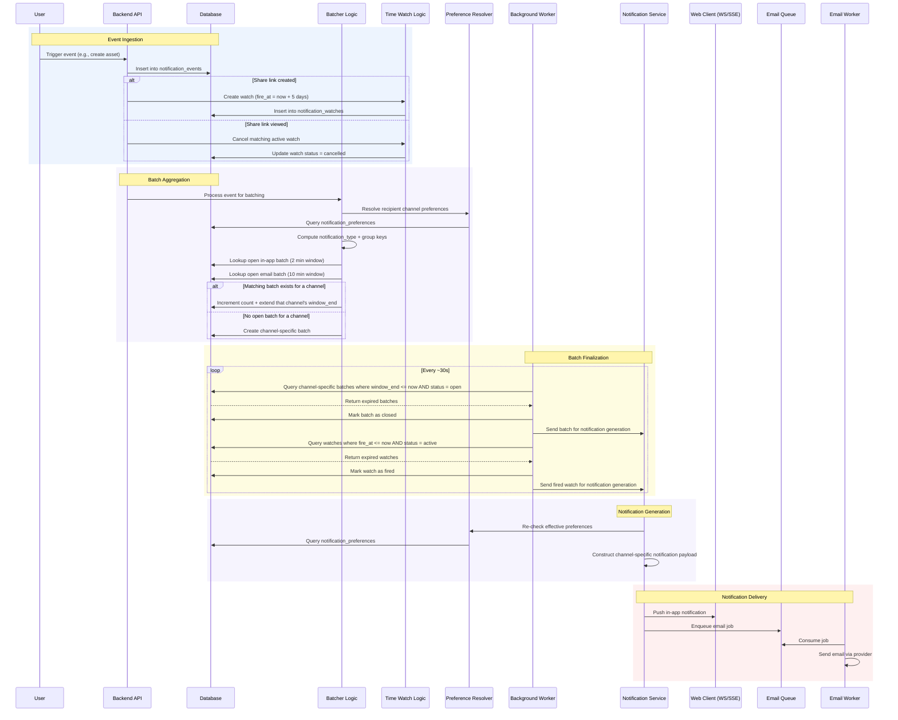
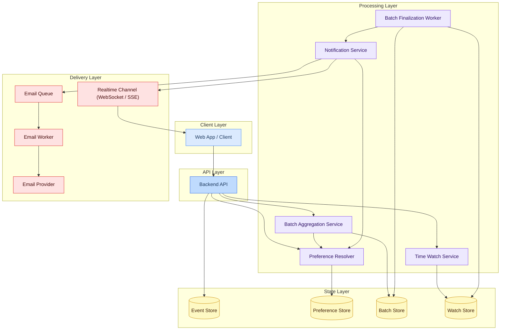

# Event Flow and Architecture

## Event Flow (Sequence Diagram)

The sequence diagram shows how a single event moves through the system from ingestion to downstream delivery. The flow breaks into six phases:

1. **Event Ingestion:** A user action (e.g., asset CRUD, download, share) triggers an event, which the backend API records and stores.
2. **Preference Resolution:** The system resolves effective user preferences per channel and notification type.
3. **Batch Aggregation:** The system maps the raw event to a canonical notification type, computes one channel-specific grouping key per eligible channel, and evaluates whether an open batch exists. Each affected batch is either updated (count incremented and window extended) or created.
4. **Batch Finalization:** A background worker periodically scans for batches whose time window has expired and marks them as closed.
5. **Notification Generation:** Before insert and fanout, the system re-checks effective user preferences, then transforms eligible finalized items into notification payloads.
6. **Notification Delivery:** The notification is fanned out to downstream channels, including real-time in-app delivery and asynchronous email processing.

Time-based absence rules (for example, "share link not viewed in 5 days") are modeled as a small parallel watch lifecycle: create a watch on share link creation, cancel it on view, and fire it on deadline if still active.

This view is useful for understanding control flow and timing boundaries, especially where synchronous request handling ends and asynchronous processing begins.

## Architecture Diagram

The sequence diagram above explains behavior over time. The architecture diagram below translates that behavior into concrete runtime boundaries, showing where responsibilities sit, which components own persistence, and how delivery fans out across realtime and asynchronous channels.

The four stores shown in the state layer are logical domains, not a requirement to run four separate databases.

## State Topology Recommendation

The state domains are separated conceptually because they have different lifecycles and access patterns. They do not need to be physically separate on day one.

Recommended starting point:

- Use one PostgreSQL cluster.[^pg]
- Implement separate tables for event, preference, batch, watch, and finalized notification state.
- Keep ownership boundaries in code (services and repositories), not in separate databases.

When to split state physically:

- Move `notification_batches` to DynamoDB first if write rate and contention on open batches become the bottleneck.
- Optionally move `notification_watches` to DynamoDB if deadline scans and cancellation lookups outgrow PostgreSQL.
- Keep `notification_events`, `notification_preferences`, and `notifications` in PostgreSQL unless there is a strong operational reason to split.

## Implementation in AWS

The AWS mapping below is opinionated for clarity. The default profile favors operational simplicity, and the scale profile shows when to introduce additional managed services.

### Recommended Profiles

| Profile  | Use When                                                                     | State Strategy                                                                                                        |
| -------- | ---------------------------------------------------------------------------- | --------------------------------------------------------------------------------------------------------------------- |
| Default  | Early to mid scale, moderate throughput, small team                          | Single PostgreSQL deployment for all notification tables                                                              |
| Scale-Up | High event throughput, hot aggregation keys, or strict p95/p99 latency goals | Keep PostgreSQL for events/preferences/final notifications, move batch state to DynamoDB, optionally move watch state |

### Client Layer

| Component        | Primary Recommendation | Alternatives    | Notes                                                                |
| ---------------- | ---------------------- | --------------- | -------------------------------------------------------------------- |
| Web App / Client | S3 + CloudFront        | Amplify Hosting | Static hosting; communicates with API over HTTP and realtime channel |

### API Layer

| Component       | Primary Recommendation | Alternatives                                        | Responsibilities                                                        |
| --------------- | ---------------------- | --------------------------------------------------- | ----------------------------------------------------------------------- |
| Express Backend | ECS on Fargate + ALB   | EKS, EC2 ASG, Lambda + API Gateway (if runtime fit) | Event ingestion, orchestration, writes to state, publishing jobs/events |

### Processing Layer

| Component                 | Primary Recommendation                                     | Alternatives                                                | Responsibilities                                                            |
| ------------------------- | ---------------------------------------------------------- | ----------------------------------------------------------- | --------------------------------------------------------------------------- |
| Batch Aggregation Service | In-process in API (initially)                              | Dedicated ECS service behind internal queue at higher scale | Compute notification type, derive grouping keys, upsert open batches        |
| Time Watch Service        | In-process in API for create/cancel                        | Dedicated service if rule count grows                       | Create and cancel watch rows                                                |
| Preference Resolver       | Shared library + read-through cache (ElastiCache optional) | Direct DB reads only                                        | Resolve effective preference for `(channel, notification_type)`             |
| Batch Finalization Worker | EventBridge Scheduler -> ECS Fargate worker                | EventBridge Scheduler -> Lambda                             | Scan expired batches/watches, close/fire, enqueue notification jobs         |
| Notification Service      | SQS-triggered ECS worker                                   | Lambda consumer                                             | Re-check preferences, build payloads, write finalized notifications, fanout |

### State Layer

| Logical Store      | Default Recommendation | Scale Recommendation                        | Why                                                                          |
| ------------------ | ---------------------- | ------------------------------------------- | ---------------------------------------------------------------------------- |
| Event Store        | PostgreSQL             | Keep in PostgreSQL                          | Append-only audit stream, straightforward indexing and retention management  |
| Preference Store   | PostgreSQL             | Keep in PostgreSQL + cache hot reads        | Simple relational overrides/defaults model                                   |
| Batch Store        | PostgreSQL             | Move to DynamoDB first                      | Hottest mutable path, benefits from conditional writes and partition scaling |
| Watch Store        | PostgreSQL             | PostgreSQL or DynamoDB based on scan volume | Deadline scans and cancellation lookups can work in either store             |
| Notification Store | PostgreSQL             | Keep in PostgreSQL                          | Durable user-facing record and auditability                                  |

> [!NOTE]
> DynamoDB is not mandatory for this design. For this architecture, PostgreSQL is the recommended default for simplicity and consistency. Introduce DynamoDB for batch state when measured throughput and contention justify the added operational complexity.

### Delivery Layer

| Component        | Primary Recommendation             | Alternatives                 | Notes                                                                                          |
| ---------------- | ---------------------------------- | ---------------------------- | ---------------------------------------------------------------------------------------------- |
| Realtime Channel | Socket.io/WebSocket on ECS service | API Gateway WebSocket        | ECS is simpler if API already runs there; API Gateway is stronger for fully decoupled realtime |
| Email Queue      | Amazon SQS                         | EventBridge bus + SQS target | Buffering, retries, and backpressure                                                           |
| Email Worker     | SQS-triggered Lambda               | ECS worker                   | Lambda is simplest at lower to moderate steady volume                                          |
| Email Provider   | Amazon SES                         | SendGrid, Mailgun            | Transactional email delivery                                                                   |

### Cross-Cutting AWS Services

| Concern                      | Recommended Service                     | Notes                                                                 |
| ---------------------------- | --------------------------------------- | --------------------------------------------------------------------- |
| Secrets                      | AWS Secrets Manager                     | Store DB credentials and provider API keys                            |
| Encryption                   | AWS KMS                                 | Encrypt data at rest and key-managed secrets                          |
| Observability                | CloudWatch + X-Ray + structured logs    | Track worker lag, queue depth, fanout errors, and latency percentiles |
| Tracing and metrics shipping | AWS Distro for OpenTelemetry            | Optional for standardized traces/metrics exports                      |
| DLQ handling                 | SQS dead-letter queues                  | Isolate poison notification jobs                                      |
| Failover and backups         | RDS/Aurora automated backups + Multi-AZ | Recovery posture for primary state store                              |

[^pg]: In AWS, PostgreSQL typically means Amazon RDS for PostgreSQL or Aurora PostgreSQL.

## Operational Considerations

- **Idempotency** — All batch updates and workers should safely retry since schedulers, queues, and restarts will fail occasionally.
- **Observability** — Track key metrics like batch count, batch age, worker lag, queue depth, delivery failures, and notification volume.
- **Failure isolation** — Email failures shouldn't affect realtime delivery, and retries shouldn't modify already-closed batches.
- **Scalability path** — Start with aggregation inside the API, then scale finalization and notifications independently as background load increases.
- **Data model choice** — Use PostgreSQL as the default store for all state domains, and move batch state to DynamoDB only when measured contention or throughput requires it.
- **Time-based correctness** — Ensure watch cancellation and firing are idempotent and mutually exclusive, so late view events cannot fire duplicate notifications.
- **Preference correctness** — Record events regardless of preference; enforce preferences at channel eligibility and again before final notification insert and fanout.
