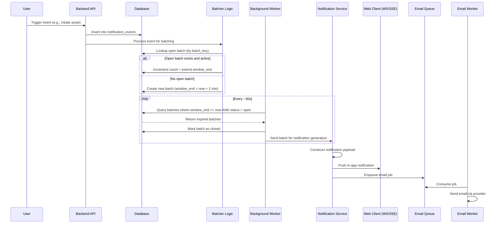

"# Air-Backend-Engineering-Challenge"

## Core Design Decision for batching notifications

For this notification system, I would model notification batching as a mutable, time-extended window keyed by (user_id, event_type, group_id) where each event either updates an existing open batch or creates a new one, and batch closure is handled asynchronously.

## Event-Driven Architecture

